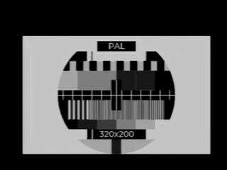

# ESP32 LVGL Example

This example show how to use video library with LVGL graphics library.

## Build

```bash
cd examples/lvgl_demo
idf.py build
idf.py flash
```

## Video mode

By default, the example generates a PAL/SECAM signal.

To generate NTSC video, use `menuconfig` to change the mode.

1. Execute `idf.py menuconfig`.
2. Go to `Component config->Example Configuration` 
3. Check `NTSC video mode instead of default PAL/SECAM`.

## Video output

